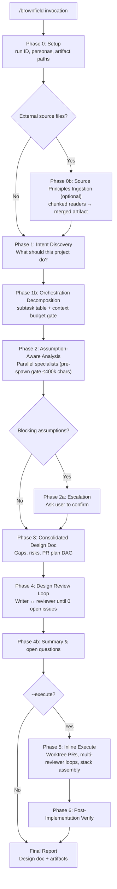

# grok-brownfield

[](LICENSE)
[](https://docs.x.ai/build/features/skills-plugins-marketplaces)
[](https://github.com/kartikkabadi/grok-brownfield/actions/workflows/verify.yml)

**Audit, validate, and improve existing codebases you can run but cannot confidently judge.**

`/brownfield` is a [Grok Build](https://docs.x.ai/build/overview) agent skill for **brownfield** projects — apps and repos that already exist. You know how to use the product; you are not sure whether the architecture, tests, security, or implementation are actually correct. Brownfield treats existing code as **evidence, not ground truth**, runs parallel specialist analysis, produces a consolidated improvement design doc, and optionally executes the plan as isolated PRs.

> **For non-technical builders:** If you can demo the app but worry something is “built wrong” under the hood, brownfield is your structured second opinion — without you reading every file.

---

## Before you begin

| Requirement | Why |
|-------------|-----|
| **[Grok Build](https://docs.x.ai/build/overview)** with `spawn_subagent` | Orchestrator delegates all substantive work |
| **Git workspace** | Analysis and execute paths expect a repo |
| **Bundled Grok skills** (`~/.grok/bundled/skills/`) | Personas: design-doc-writer, design-doc-reviewer, implementer, reviewer, security-auditor |
| **AskQuestion** (or equivalent) | Assumption escalation in Phase 2a |
| **Optional:** `gt` (Graphite), `gh` (GitHub CLI) | Stack assembly and `--auto-pr` |

**Windows:** Paths below use Unix `~/.grok/...`. On Windows, use `%USERPROFILE%\.grok\skills\brownfield` (or run Grok Build under WSL with the Unix paths).

**Contributors / CI:** Verify scripts also work with the repo fixture at `fixtures/bundled-skills/` — no full Grok install required. See [Verification](#verification).

---

## Non-technical quick path

Just want a health check on a project you can run but do not fully trust?

1. **Install** the skill (clone step below) and **reload Grok Build** (see Quick start).
2. **Open your project** in Grok Build so the agent can see the repo.
3. In the **Grok Build chat input** (where you normally talk to the agent), type:
   ```
   /brownfield ./path-to-your-project
   ```
   Use the folder path to your codebase — ask a developer for the exact path if unsure.
4. **Wait for the design doc** — brownfield stops after the improvement plan unless you add `--execute`.
5. **Involve a developer** when the report mentions PRs, security findings, or `--execute`.

---

## The problem brownfield solves

| You can… | You cannot… | Brownfield gives you… |
|----------|---------------|------------------------|
| Run and click through the app | Judge if architecture matches intent | Intent brief + assumption register |
| Ship features in a legacy repo | Tell if tests or security are adequate | Parallel specialist audits |
| Describe what “should” happen | Know if the code actually does that | Design doc with PR plan |
| Want fixes, not just a report | Safely implement across many files | Optional `--execute` with reviewers |

**Core philosophy:** Specialists question assumptions, flag low-confidence areas, and escalate blocking questions to you before recommending changes.

---

## Quick start

### Install (Grok Build)

**Recommended — full repo** (includes verify scripts for development):

```bash
git clone https://github.com/kartikkabadi/grok-brownfield.git
cd grok-brownfield
cp -r . ~/.grok/skills/brownfield/
```

**Skill file only** (runtime minimum — no local verify tooling):

```bash
git clone https://github.com/kartikkabadi/grok-brownfield.git
cd grok-brownfield
mkdir -p ~/.grok/skills/brownfield
cp SKILL.md ~/.grok/skills/brownfield/
```

**Reload Grok Build** so the skill is discovered:

1. Save any open work in your Grok Build session.
2. **Restart the Grok Build app**, or use your environment’s **Reload skills / Refresh skills** action (often in settings or the command palette).
3. Confirm `/brownfield` appears in skill autocomplete when you type `/` in the agent chat input.

If the skill does not appear, verify `~/.grok/skills/brownfield/SKILL.md` exists and reload again.

### Run

**Where to type this:** In the **Grok Build agent chat input** (the main prompt where you instruct the coding agent) — not your system shell, unless your Grok setup documents a CLI entry point.

Point `project path` at the root of the Git repo you want audited (the folder that contains `.git`).

In the Grok CLI/TUI, selecting `/brownfield` shows a **prefilled usage preview** (same pattern as `/execute-plan`):

```
/brownfield <project path or description> [--effort N] [--execute] [--delegate-execute] [--concurrency N] [--no-graphite] [--auto-pr] [--resume <BROWNFIELD_ID>] [--cleanup-deliverables]
```

Examples:

```
/brownfield ./my-repo
/brownfield ./my-repo --effort 3 "focus on checkout flow"
/brownfield ./my-repo --execute --effort 4
```

---

## Glossary

| Term | Meaning |
|------|---------|
| **PR** | Pull request — a proposed code change on GitHub (or similar) |
| **Worktree** | An isolated copy of the repo used to implement one PR without touching your main checkout |
| **Graphite (`gt`)** | Optional CLI for stacked PR workflows |
| **DAG** | Directed acyclic graph — PR dependency order in the execution plan |
| **Persona** | Specialist instructions loaded from bundled Grok skills (e.g. security-auditor) |

---

## Workflow



**Context budget:** Every specialist spawn is capped at **400,000 characters** (~100k tokens). Phase 1b records per-subtask estimates; the orchestrator runs a **pre-spawn gate** before launch and logs outcomes in the spawn log. Over-budget payloads are chunked or split — never silently truncated. Full `SKILL.md` is never injected into specialist prompts (persona + excerpt-only transport).

**Deliverables** (kept by default under `/tmp/grok-brownfield-*`):

- Intent brief
- Assumptions register
- **Orchestration plan** (Phase 1b subtask decomposition)
- **Spawn log** (pre-spawn estimates vs 400k cap per specialist)
- Merged analysis
- **Design document** (main output) with PR plan
- Optional source-merged artifact when Phase 0b runs
- Optional verify report after `--execute`

---

## Comparison: brownfield vs `/implement` vs `/design`

| | `/brownfield` | `/design` | `/implement` |
|---|---------------|-----------|--------------|
| **Starting point** | Existing repo you may not understand | New feature or change idea | Approved design / plan |
| **Treats code as** | Evidence to question | N/A (greenfield) | Instructions to follow |
| **Analysis** | Multi-specialist audit + assumptions | Requirements → design | Single-task implementation |
| **Output** | Improvement design doc + optional PRs | Design doc | Code changes |
| **Best for** | “Is this built correctly?” | “How should we build X?” | “Build X per this plan” |

Brownfield often **feeds** implement: Phase 5 inline execute uses worktree-isolated implementers and effort-scaled reviewers; `--delegate-execute` falls back to `/execute-plan`.

---

## Choosing effort (decision tree)

```
Need a quick sanity check?          → effort 1 (architecture + code)
Shipping soon / auth or payments?   → effort 4 (+ security specialist)
Want best quality end-to-end?       → effort 5 (+ dual code review, 6 execute reviewers)
Also want PRs implemented?          → add --execute
```

Brownfield applies **first-principles thinking** at effort ≥ 3: decompose to axioms, think in limits (scale/latency/cost), design toward the platonic ideal, and exit review loops only at **0 open issues**.

## Effort vs `--execute`

Two independent knobs:

### `--effort N` (1–5) — rigor in analysis **and** execution

| Effort | Analysis (pass 1) | Analysis (pass 2) | Execute reviewers per PR (inline) |
|--------|-------------------|-------------------|-----------------------------------|
| **1** | Architecture | Code only* | 1 |
| **2** | + Product-Intent | + Tests | 2 |
| **3** | (same as 2) | + Documentation | 3 |
| **4** | (same as 2) | + Security | 5 |
| **5** | (same as 2) | + second Code specialist | 6 |

\*Intent keywords (e.g. “security”, “auth”) can add Tests, Security, or Documentation even at effort 1.

### `--execute` — run the PR plan after design review passes

- **Without `--execute`:** Stops after design doc reaches **0 open review issues** (audit + plan only).
- **With `--execute`:** Runs Phase 5–6 — worktree-isolated PRs, per-PR reviewer loops, Graphite or plain-git stack assembly, post-implementation verification.
- **`--delegate-execute`:** Lower-rigor fallback; delegates to `/execute-plan` at effort 1 per PR (requires `--execute`).

---

## Example invocations

```bash
# Quick audit — architecture + code review, design doc only
/brownfield ./my-saas-app

# Deeper audit with security and docs specialists
/brownfield ./my-saas-app --effort 4 "review payment and auth flows"

# Full pipeline: audit → design → implement → verify (max rigor)
/brownfield ./my-saas-app --execute --effort 5

# Resume a crashed execute run (ID from state file)
/brownfield --resume a1b2c3d4

# Force plain git + auto draft PRs (no Graphite)
/brownfield ./my-repo --execute --no-graphite --auto-pr
```

---

## Flags reference

| Flag | Default | Purpose |
|------|---------|---------|
| `--effort N` (1–5) | 1 | Scales analysis specialists and per-PR implementation reviewers |
| `--execute` | off | After design review, run the PR plan (inline by default) |
| `--delegate-execute` | off | Force `/execute-plan` instead of inline execute (effort 1 per PR; requires `--execute`) |
| `--no-graphite` | off | Plain-git stack even when Graphite (`gt`) is installed |
| `--auto-pr` | off | In plain-git mode, create draft PRs via `gh pr create` when available |
| `--resume ID` | — | Resume crashed runs; restores effort and flags from state |
| `--concurrency N` (1–8) | 4 | Max parallel PR implementers during `--execute` |
| `--cleanup-deliverables` | off | Remove state file and verify artifact after final report |

---

## Resume guide

State file: `/tmp/grok-brownfield-state-<BROWNFIELD_ID>.json` (8 hex chars)

| `phase` in state | Command |
|------------------|---------|
| `execute_inline` (or legacy `execute`) | `/brownfield --resume <ID>` |
| `execute_pending` | `/brownfield --resume <ID>` |
| `execute_delegated` | `/execute-plan --resume <execute_plan_id>` (read id from brownfield state) |
| `verify` | `/brownfield --resume <ID>` |

On resume, CLI `--effort` / `--execute` flags are ignored; values are restored from the state file.

---

## Verification

Structure and regression checks ship with the repo. **GitHub Actions** runs the same scripts on every push/PR (see [`.github/workflows/verify.yml`](.github/workflows/verify.yml)).

```bash
cd grok-brownfield

# Quick verification with Makefile
make all              # Run verify + test + bootstrap in sequence
make verify           # Run structure verification only
make test             # Run negative/regression tests only

# Or run scripts directly
bash scripts/bootstrap_bundled_fixture.sh   # validates fixtures/bundled-skills
bash scripts/verify_skill.sh                # structure, patterns, persona resolution
bash tests/test_verify_skill.sh             # negative / regression tests
```

Both verify commands should exit `0`. CI uses `fixtures/bundled-skills/` via `BUNDLED_SKILLS_ROOT`; locally, scripts prefer `~/.grok/bundled/skills/` when installed, then fall back to the fixture.

---

## Repository layout

```
grok-brownfield/
├── README.md
├── SKILL.md              # Full skill specification (~2000 lines)
├── CHANGELOG.md          # Changelog for tracking changes
├── LICENSE               # MIT
├── NOTICE                # Runtime bundled-skills dependency boundary
├── CONTRIBUTING.md
├── CODE_OF_CONDUCT.md
├── SECURITY.md
├── AGENTS.md
├── Makefile              # Convenience targets for development
├── .pre-commit-config.yaml  # Pre-commit hooks for verification
├── fixtures/
│   └── bundled-skills/   # Portable verify fixture (CI + contributors)
├── scripts/
│   ├── verify_skill.sh
│   ├── resolve_bundled_root.sh
│   ├── bootstrap_bundled_fixture.sh
│   └── dev_setup.sh      # One-command development setup
├── tests/
│   └── test_verify_skill.sh
└── .github/
    ├── workflows/verify.yml
    ├── ISSUE_TEMPLATE/
    └── pull_request_template.md
```

---

## Design philosophy

Brownfield is built around **assumption-checking**, not rubber-stamping:

1. **Existing code is evidence** — behavior may be accidental, outdated, or wrong.
2. **Parallel specialists** — architecture, product intent, code, tests, security, documentation.
3. **Confidence levels** — low-confidence blocking assumptions escalate to the user.
4. **Review loops** — design doc is reviewed until zero open issues.
5. **Optional execution** — same effort knob scales implementation reviewers when you are ready to ship fixes.

See [SKILL.md](./SKILL.md) for the complete orchestration spec.

---

## FAQ

**What is the difference between effort levels?**
Effort scales analysis depth, specialist count, and implementation rigor. Effort 1 is a quick architecture+code audit (~5–15 min). Effort 5 adds dual code review, security, documentation, and max rigor for execution (1–4 hours). See the [Effort Model table](#choosing-effort-decision-tree) for details.

**Should I use --execute or delegate to /execute-plan?**
Use inline `--execute` for maximum control (effort-scaled reviewers, worktree isolation). Use `--delegate-execute` for simpler workflows or if you prefer the standard `/execute-plan` orchestration (effort 1 per PR, less rigorous). Inline execute is the default and recommended for most cases.

**What happens if the run crashes mid-execute?**
Brownfield writes state to `/tmp/grok-brownfield-state-<BROWNFIELD_ID>.json`. Resume with `/brownfield --resume <ID>`. The orchestrator restores phase, effort, flags, and continues from the last checkpoint. See the [Resume guide](#resume-guide) for phase-specific resume paths.

**How do I clean up /tmp artifacts after a run?**
Use `/brownfield --cleanup-deliverables` to remove the state file and verification artifact after the final report. Or manually remove `/tmp/grok-brownfield-*` files when done. Artifacts are kept by default for debugging and review.

**Can brownfield work on non-Git projects?**
No. Brownfield requires a Git workspace for analysis paths, worktree isolation during execution, and state tracking. The skill validates the workspace root during Phase 0 setup and fails if not in a Git repository.

**What are the deliverables and where do they go?**
Deliverables are written to `/tmp/grok-brownfield-*` by default: intent brief, assumptions register, orchestration plan, spawn log, merged analysis, design document, and optional verify report. Each file is timestamped and includes the `BROWNFIELD_ID` for traceability.

**How long does a typical run take?**
Small projects (<10k LOC): 5–15 minutes. Medium projects (10k–100k LOC): 15–60 minutes. Large projects (>100k LOC): 1–4 hours. Duration scales with effort level, number of specialists, context budget chunking, and whether `--execute` is used. Analysis is ~40% of total time; execution adds significant overhead.

**Can I reuse design docs across projects?**
Design documents are project-specific and contain architecture assessments, assumption registers, and PR plans tied to the analyzed codebase. However, the process and template are reusable. Consider saving exemplary design docs as internal patterns for your team.

**What if I disagree with a specialist's finding?**
Specialists work with evidence, not ground truth. If you disagree, escalate via the assumption register or design review. The orchestrator flags low-confidence areas for user confirmation. You can provide additional context, correct assumptions, or adjust scope. The design review loop (Phase 4) exists to resolve exactly these disagreements.

**How do I customize which specialists run?**
Specialist selection is effort-gated. Use `--effort N` to control depth. Intent keywords (e.g., "security", "auth") can add optional specialists even at lower effort levels. For custom specialist rosters beyond effort knobs, you would need to modify the skill orchestration logic (see [SKILL.md](./SKILL.md) Phase 1b).

---

## Troubleshooting

**Skill not appearing in Grok Build after install**
- Verify `~/.grok/skills/brownfield/SKILL.md` exists
- Restart Grok Build (reload skills/refresh in settings)
- Check frontmatter name is `brownfield` (not a different name)
- See [Install](#quick-start) section for full setup steps

**Persona resolution failures (bundled skills missing)**
- Verify Grok Build bundled skills exist at `~/.grok/bundled/skills/`
- Run `bash scripts/bootstrap_bundled_fixture.sh` to validate the fixture
- Set `BUNDLED_SKILLS_ROOT` explicitly if using a custom path
- Ensure required personas exist: design-doc-writer, design-doc-reviewer, implementer, reviewer, security-auditor

**Resume failures (state file not found)**
- Check `/tmp/grok-brownfield-state-<ID>.json` exists
- Verify the `BROWNFIELD_ID` is correct (8 hex characters)
- Ensure you're resuming from the same Grok Build session/workspace
- State files are not portable across different Grok Build installations

**Context budget errors during execution**
- Large files may trigger chunking (expected for files >400k characters)
- Check the spawn log at `/tmp/grok-brownfield-spawn-log-<ID>.md` for details
- Chunking is automatic; errors indicate something failed during chunk worker spawn
- File a bug if chunking fails on reasonable file sizes

**Git workspace validation failures**
- Ensure you're in a Git repository (run `git rev-parse --show-toplevel`)
- Check that the repository is not a shallow clone (some operations require full history)
- Verify you have write permissions for worktree creation during `--execute`
- Run `git status` to check for uncommitted changes that may block operations

**Collecting debug info for bug reports**
- Capture the exact `/brownfield` invocation (redact paths)
- Include the `BROWNFIELD_ID` from the error message
- Attach relevant artifact names from `/tmp/grok-brownfield-*` (sanitize contents)
- Note your Grok Build version and platform
- Run `bash scripts/verify_skill.sh` and include output if relevant

See [CONTRIBUTING.md](./CONTRIBUTING.md) for bug reporting guidelines and the [bug report template](.github/ISSUE_TEMPLATE/bug_report.yml).

---

## Contributing

Issues and PRs welcome. See [CONTRIBUTING.md](./CONTRIBUTING.md), [CODE_OF_CONDUCT.md](./CODE_OF_CONDUCT.md), and [AGENTS.md](./AGENTS.md).

---

## License

MIT © [Kartik Kabadi](https://github.com/kartikkabadi) — see [LICENSE](./LICENSE).

Runtime bundled Grok personas are **not** covered by this repo’s MIT license — see [NOTICE](./NOTICE).