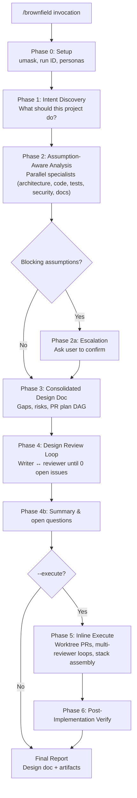

# grok-brownfield

[](LICENSE)
[](https://github.com/kartikkabadi/grok-brownfield)
[](#verification)

**Audit, validate, and improve existing codebases you can run but cannot confidently judge.**

`/brownfield` is a [Grok Build](https://x.ai) agent skill for **brownfield** projects — apps and repos that already exist. You know how to use the product; you are not sure whether the architecture, tests, security, or implementation are actually correct. Brownfield treats existing code as **evidence, not ground truth**, runs parallel specialist analysis, produces a consolidated improvement design doc, and optionally executes the plan as isolated PRs.

> **For non-technical builders:** If you can demo the app but worry something is “built wrong” under the hood, brownfield is your structured second opinion — without you reading every file.

---

## The problem brownfield solves

| You can… | You cannot… | Brownfield gives you… |
|----------|---------------|------------------------|
| Run and click through the app | Judge if architecture matches intent | Intent brief + assumption register |
| Ship features in a legacy repo | Tell if tests or security are adequate | Parallel specialist audits |
| Describe what “should” happen | Know if the code actually does that | Design doc with PR plan |
| Want fixes, not just a report | Safely implement across many files | Optional `--execute` with reviewers |

**Core philosophy:** Specialists question assumptions, flag low-confidence areas, and escalate blocking questions to you before recommending changes.

---

## Quick start

### Install (Grok Build)

Copy or clone this skill into your Grok skills directory:

```bash
git clone https://github.com/kartikkabadi/grok-brownfield.git ~/.grok/skills/brownfield
```

Or copy only the skill file:

```bash
mkdir -p ~/.grok/skills/brownfield
cp SKILL.md ~/.grok/skills/brownfield/
```

Restart or reload Grok Build so the skill is discovered.

### Run

In Grok Build, invoke:

```
/brownfield ./my-repo
/brownfield --effort 3 ./my-repo "focus on checkout flow"
/brownfield --execute --effort 4 ./my-repo
```

---

## Workflow



**Deliverables** (kept by default under `/tmp/grok-brownfield-*`):

- Intent brief
- Assumptions register
- Merged analysis
- **Design document** (main output) with PR plan
- Optional verify report after `--execute`

---

## Comparison: brownfield vs `/implement` vs `/design`

| | `/brownfield` | `/design` | `/implement` |
|---|---------------|-----------|--------------|
| **Starting point** | Existing repo you may not understand | New feature or change idea | Approved design / plan |
| **Treats code as** | Evidence to question | N/A (greenfield) | Instructions to follow |
| **Analysis** | Multi-specialist audit + assumptions | Requirements → design | Single-task implementation |
| **Output** | Improvement design doc + optional PRs | Design doc | Code changes |
| **Best for** | “Is this built correctly?” | “How should we build X?” | “Build X per this plan” |

Brownfield often **feeds** implement: Phase 5 inline execute uses worktree-isolated implementers and effort-scaled reviewers; `--delegate-execute` falls back to `/execute-plan`.

---

## Effort vs `--execute`

Two independent knobs:

### `--effort N` (1–5) — rigor in analysis **and** execution

| Effort | Analysis (pass 1) | Analysis (pass 2) | Execute reviewers per PR (inline) |
|--------|-------------------|-------------------|-----------------------------------|
| **1** | Architecture | Code only* | 1 |
| **2** | + Product-Intent | + Tests | 2 |
| **3** | (same as 2) | + Documentation | 3 |
| **4** | (same as 2) | + Security | 5 |
| **5** | (same as 2) | + second Code specialist | 6 |

\*Intent keywords (e.g. “security”, “auth”) can add Tests, Security, or Documentation even at effort 1.

### `--execute` — run the PR plan after design review passes

- **Without `--execute`:** Stops after design doc reaches **0 open review issues** (audit + plan only).
- **With `--execute`:** Runs Phase 5–6 — worktree-isolated PRs, per-PR reviewer loops, Graphite or plain-git stack assembly, post-implementation verification.
- **`--delegate-execute`:** Lower-rigor fallback; delegates to `/execute-plan` at effort 1 per PR (requires `--execute`).

---

## Example invocations

```bash
# Quick audit — architecture + code review, design doc only
/brownfield ./my-saas-app

# Deeper audit with security and docs specialists
/brownfield --effort 4 ./my-saas-app "review payment and auth flows"

# Full pipeline: audit → design → implement → verify
/brownfield --execute --effort 4 ./my-saas-app

# Resume a crashed execute run (ID from state file)
/brownfield --resume a1b2c3d4

# Force plain git + auto draft PRs (no Graphite)
/brownfield --execute --no-graphite --auto-pr ./my-repo
```

---

## Flags reference

| Flag | Default | Purpose |
|------|---------|---------|
| `--effort N` (1–5) | 1 | Scales analysis specialists and per-PR implementation reviewers |
| `--execute` | off | After design review, run the PR plan (inline by default) |
| `--delegate-execute` | off | Force `/execute-plan` instead of inline execute (effort 1 per PR; requires `--execute`) |
| `--no-graphite` | off | Plain-git stack even when Graphite (`gt`) is installed |
| `--auto-pr` | off | In plain-git mode, create draft PRs via `gh pr create` when available |
| `--resume ID` | — | Resume crashed runs; restores effort and flags from state |
| `--concurrency N` (1–8) | 4 | Max parallel PR implementers during `--execute` |
| `--cleanup-deliverables` | off | Remove state file and verify artifact after final report |

---

## Resume guide

State file: `/tmp/grok-brownfield-state-<BROWNFIELD_ID>.json` (8 hex chars)

| `phase` in state | Command |
|------------------|---------|
| `execute_inline` (or legacy `execute`) | `/brownfield --resume <ID>` |
| `execute_pending` | `/brownfield --resume <ID>` |
| `execute_delegated` | `/execute-plan --resume <execute_plan_id>` (read id from brownfield state) |
| `verify` | `/brownfield --resume <ID>` |

On resume, CLI `--effort` / `--execute` flags are ignored; values are restored from the state file.

---

## Requirements

| Requirement | Why |
|-------------|-----|
| **Grok Build** with `spawn_subagent` | Orchestrator delegates all substantive work |
| **Git workspace** | Analysis and execute paths expect a repo |
| **Bundled Grok skills** (`~/.grok/bundled/skills/`) | Personas: design-doc-writer, design-doc-reviewer, implementer, reviewer, security-auditor |
| **AskQuestion** (or equivalent) | Assumption escalation in Phase 2a |
| **Optional:** `gt` (Graphite), `gh` (GitHub CLI) | Stack assembly and `--auto-pr` |

---

## Verification

Structure and regression checks ship with the repo:

```bash
cd grok-brownfield
bash scripts/verify_skill.sh      # structure, patterns, bundled persona resolution
bash tests/test_verify_skill.sh   # negative / regression tests
```

Both should exit `0`. CI-friendly: no network required beyond local `~/.grok/bundled/skills/`.

---

## Repository layout

```
grok-brownfield/
├── README.md          # This file
├── SKILL.md           # Full skill specification (~2000 lines)
├── LICENSE            # MIT
├── CONTRIBUTING.md
├── AGENTS.md
├── scripts/
│   └── verify_skill.sh
└── tests/
    └── test_verify_skill.sh
```

---

## Design philosophy

Brownfield is built around **assumption-checking**, not rubber-stamping:

1. **Existing code is evidence** — behavior may be accidental, outdated, or wrong.
2. **Parallel specialists** — architecture, product intent, code, tests, security, documentation.
3. **Confidence levels** — low-confidence blocking assumptions escalate to the user.
4. **Review loops** — design doc is reviewed until zero open issues.
5. **Optional execution** — same effort knob scales implementation reviewers when you are ready to ship fixes.

See [SKILL.md](./SKILL.md) for the complete orchestration spec.

---

## Contributing

Issues and PRs welcome. See [CONTRIBUTING.md](./CONTRIBUTING.md) and [AGENTS.md](./AGENTS.md).

---

## License

MIT © [Kartik Kabadi](https://github.com/kartikkabadi) — see [LICENSE](./LICENSE).